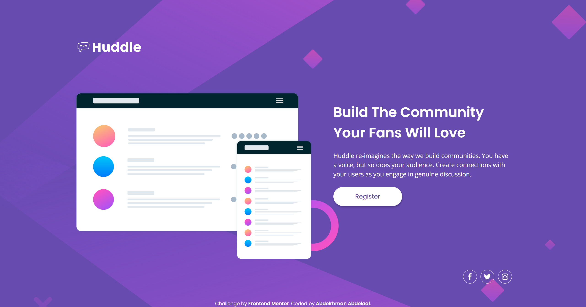

# Frontend Mentor - Huddle Landing Page with a Single Introductory Section solution

This is a solution to the [Huddle Landing Page with a Single Introductory Section challenge on Frontend Mentor](https://www.frontendmentor.io/challenges/huddle-landing-page-with-a-single-introductory-section-B_2Wvxgi0). Frontend Mentor challenges help you improve your coding skills by building realistic projects.

## Table of contents

- [Overview](#overview)
  - [Screenshot](#screenshot)
  - [Links](#links)
- [My process](#my-process)
  - [Built with](#built-with)
  - [What I learned](#what-i-learned)
  - [Known deviation from design](#known-deviation-from-design)
  - [Continued development](#continued-development)
- [Author](#author)

## Overview

### Screenshot



### Links

- Solution URL: [GitHub](https://github.com/MrBlackvanta/huddle-landing-page-with-a-single-introductory-section)
- Live Site URL: [Netlify](https://vanta-huddle-landing-page.netlify.app)

## My process

### Built with

- [Next.js 16](https://nextjs.org/) (App Router, React Compiler, Turbopack)
- [React 19](https://react.dev/)
- TypeScript
- [Tailwind CSS v4](https://tailwindcss.com/) (theme via `@theme`, custom utilities via `@utility`)
- `next/font` for Poppins + Open Sans (self-hosted, `display: swap`)
- Semantic HTML5 landmarks (`<main>`, `<header>`, `<section>`, `<footer>`)
- Mobile-first responsive layout, a single `lg:` breakpoint
- Fully static output — all routes pre-rendered at build time

### What I learned

**When to use `useId()` for SVG internal references.** Figma-exported SVGs frequently ship with short internal IDs (`id="a"`, `id="b"`) for gradients, filters, clipPaths, and `<use>` references. If two such SVGs land on the same page, `url(#a)` resolves to whichever element appears first in the DOM — so gradients and filters silently break. Scoping each declared ID with a `useId()` prefix avoids collisions entirely.

```tsx
const uid = useId();
const id = (key: string) => `${uid}-${key}`;
const ref = (key: string) => `url(#${id(key)})`;

return (
  <svg>
    <defs>
      <linearGradient id={id("a")}>…</linearGradient>
    </defs>
    <path fill={ref("a")} />
  </svg>
);
```

The tradeoff is that `useId()` is a hook, so the component must be a Client Component. For a single-instance illustration it's pure overhead — a manual prefix (`id="mockups-a"`) or shipping the SVG as a static asset works just as well. I kept `useId()` only on `IllustrationMockupsIcon` where it carries its weight (11 IDs, complex filters); the two background SVGs moved to `/public/` and are rendered via CSS `background-image`, dropping two client components.

**When to reach for a CSS background vs. an inline SVG component.** Inline SVGs are worth it when you need to drive them dynamically (animate paths, swap colors via `currentColor`, interact with elements). Decorative, static backgrounds are cheaper and simpler as files in `/public/` used with `bg-[url('/bg-desktop.svg')] bg-cover` — no component, no client-side JS, browser-cached independently, and `bg-cover` already solves the fill-the-viewport problem that `preserveAspectRatio="xMidYMid slice"` would solve inside an inline SVG.

**Sticky-footer layout without ceremony.**

```tsx
<body className="flex min-h-dvh flex-col …">
  <main className="flex flex-1 items-center …">{children}</main>
  <Footer />
</body>
```

`min-h-dvh` makes the body at least viewport height. `flex flex-col` stacks children vertically. `flex-1` on `<main>` lets it absorb all remaining space so the footer naturally sits at the bottom. `items-center` on `<main>` vertically centers the content block inside the grown main. I first tried `grid place-content-center`, but that centers rows as a group — the footer floats up with the content instead of pinning to the bottom. Flex is the right primitive here.

**Accessible icon-only links.** `<a title="Facebook">` is **not** an accessible name — screen readers treat `title` as advisory, not authoritative. The correct pattern is `aria-label="Facebook"` on the link and `aria-hidden="true"` on the inner SVG so the icon doesn't get double-announced.

```tsx
<a href="…" aria-label="Facebook">
  <FacebookIcon aria-hidden="true" />
</a>
```

Same applies to the logo: "Huddle" exists only as SVG paths, so without `aria-label="Huddle"` + `role="img"` on the component, the brand name is invisible to assistive tech.

**`next/font/google` in Next.js.** Declaring fonts in `layout.tsx` rather than linking Google Fonts in `<head>` means the CSS is served from your own origin, the subset is narrowed, and there's no extra DNS round trip. `display: "swap"` prevents FOIT.

**Project hygiene for small builds.** I scaffolded the project with the shadcn preset out of habit, then realized the page renders one button and no components that benefit from cva variants or Radix primitives. The cleanup pass removed `shadcn`, `cva`, `clsx`, `tailwind-merge`, `radix-ui`, `tw-animate-css`, the `lib/utils.ts` `cn` helper, and the full `:root` / `.dark` shadcn theme block from `globals.css`. The final `package.json` has just `next`, `react`, and `react-dom` in `dependencies`. For this size of project, shadcn was overkill — I'll keep it for larger builds where the variant system actually earns its footprint.

### Known deviation from design

The Figma spec shows the Register button's hover state as `soft-magenta` background with white text. White on `hsl(300, 69%, 71%)` has a contrast ratio of about 1.8:1 — well below the WCAG AA threshold of 4.5:1 for normal text. I implemented the hover exactly as designed to preserve visual fidelity for this challenge, but in a real product I would push back on that hover color or keep the violet text color on hover (contrast ≈ 4.1:1, much closer to AA). This deviation is intentional and documented here for transparency.

### Continued development

- Write a codemod (beyond the regex script in `/scripts/scope-svg-ids.mjs`) that uses a real AST parser so it handles destructured props, existing hooks, and composite `url(#a) blur(…)` attribute values safely.
- Add Playwright + axe-core for automated accessibility regression testing on larger challenges.
- Explore using CSS `@property` for typed custom properties and smoother color transitions on hover.

## Author

- UpWork - [Abdelrhman Abdelaal](https://upwork.com/freelancers/~01f0a9479696b61f49)
- Frontend Mentor - [@MrBlackvanta](https://www.frontendmentor.io/profile/MrBlackvanta)
- LinkedIn - [Abdelrhman Abdelaal](https://www.linkedin.com/in/abdelrhman-vanta/)
